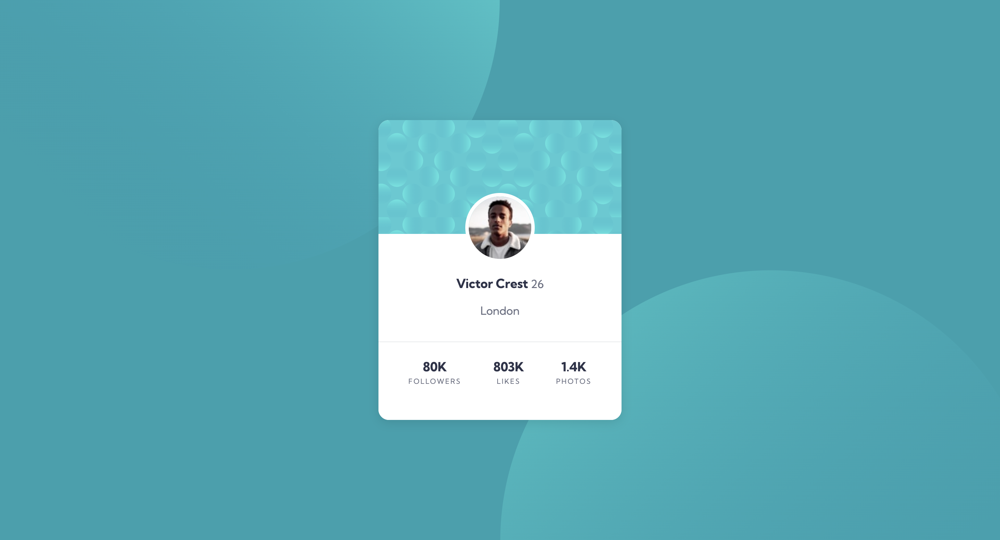

# Profile Card Component 🚀

This is a solution to the Profile Card Component challenge on **Frontend Mentor**. This project focuses on building a responsive and clean profile card layout.

## 🛠️ Technologies Used:

- **HTML5** (Using Semantic elements like `figure` and `figcaption`)
- **CSS3** (Flexbox layout, custom background positioning)
- **Google Fonts** (Kumbh Sans font family)

## 📸 Screenshot

## 🌐 Links:

- **Live Site URL:** https://raghad2088.github.io/profile-card-component/
- **Solution URL:** https://github.com/raghad2088/profile-card-component
- **Frontend Mentor Challenge:**https://www.frontendmentor.io/challenges/profile-card-component-cfArpWshJ

## 💡 What I Learned:

### 🏛️ Semantic Structure & Grouping

- **Component-Driven Grouping:** I learned how to logically group related data and elements into dedicated containers (like wrapping the stats inside a `footer` and profile details in a `.child-container`). This kept the HTML structural, semantic, and much easier to style.
- **Whitespace Management:** I gained hands-on experience in managing white space and distributing gaps between content efficiently using CSS properties like `gap`, `padding`, and `margin`.

### 🧩 Layout Challenges & Problem Solving

- **Flexbox Alignment:** Mastered the alignment of items along both axes using `justify-content` and `align-items`. I specifically learned how `align-items: stretch` can force child elements (like the footer) to span the full width of their parent container.
- **Debugging GitHub Pages:** I faced a real-world debugging challenge where the live site on GitHub Pages layout broke due to browser caching issues and minor layout leaks. I successfully resolved it by adjusting the elements' flexibility (`width: auto` and `align-self: center`) and learning how to hard-refresh (`Ctrl + F5`) to force the browser to read the latest CSS changes.
